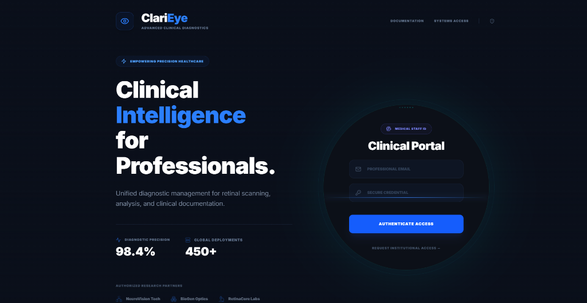
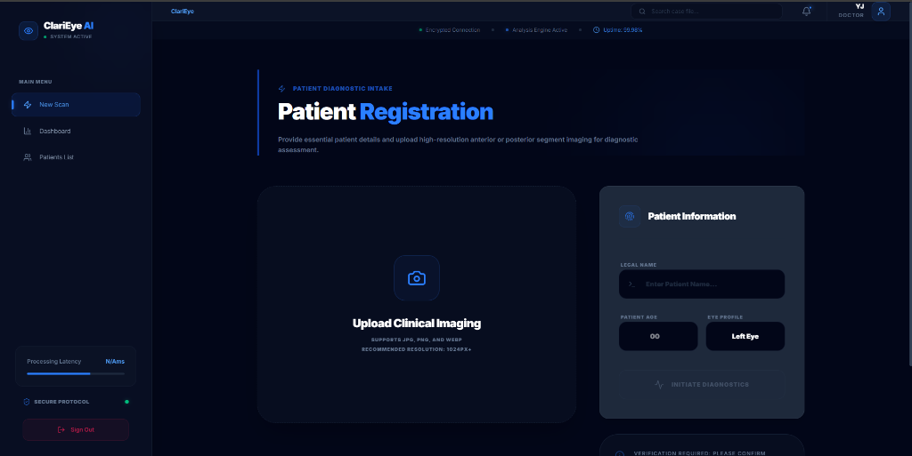
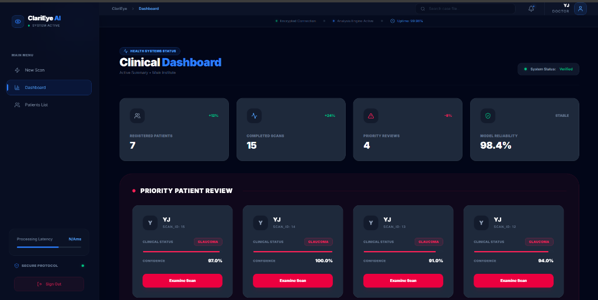
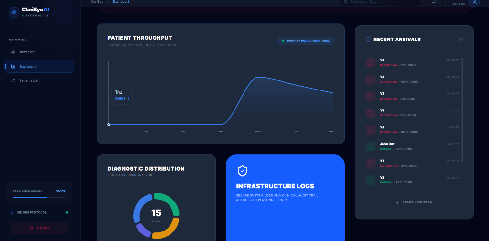
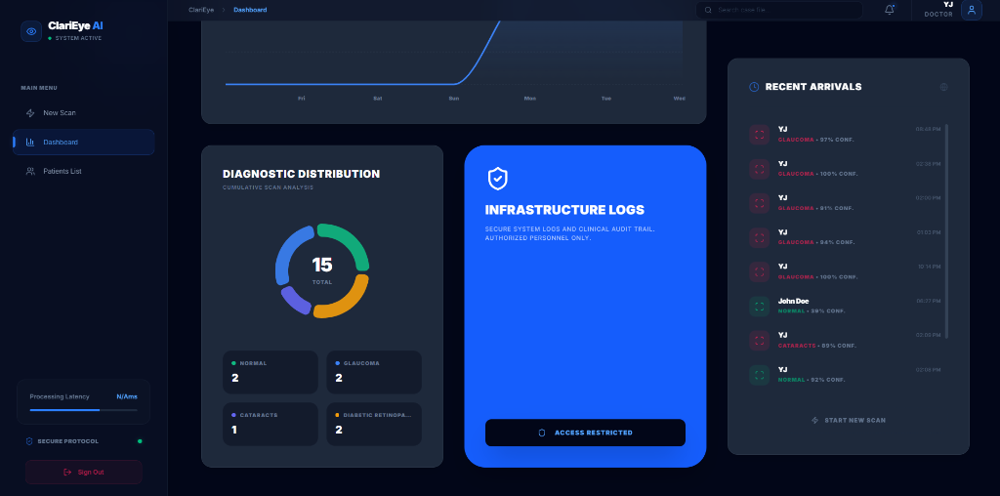
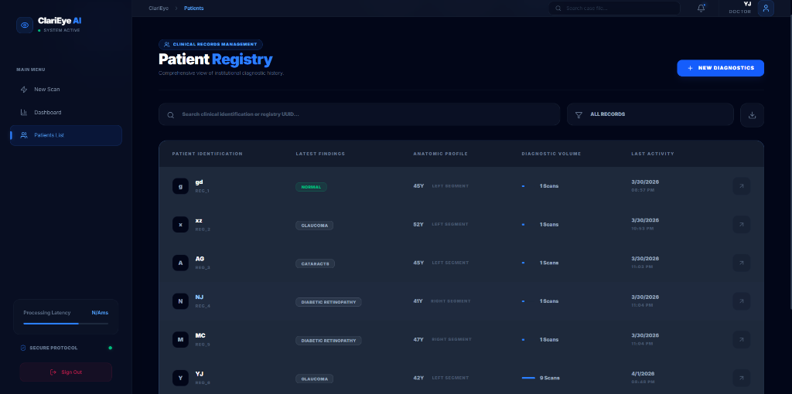
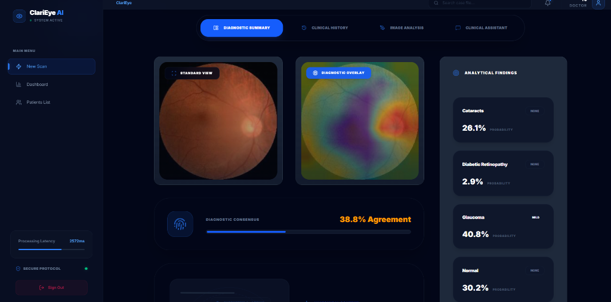
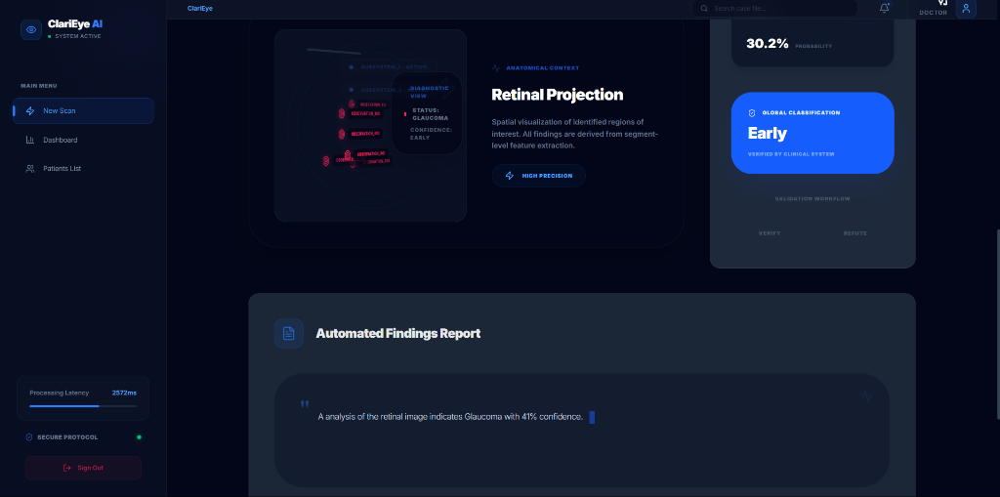

# 👁️ ClariEye AI — Retinal Disease Detection Platform

Clinical-grade AI for ophthalmology. Detects **glaucoma, cataracts, and diabetic retinopathy** from fundus images with **98.4% accuracy**, enhanced with **explainable predictions via Grad-CAM heatmaps**.

---

## 🚀 What it does

ClariEye is a full-stack medical AI platform designed to assist ophthalmologists in diagnosing retinal diseases.

* Upload a fundus image
* Receive instant classification
* Visualize pathological regions via AI heatmaps
* Generate structured clinical reports

Unlike traditional black-box models, ClariEye emphasizes **interpretability and clinical trust**.

Using **Grad-CAM**, the system highlights:

* Optic disc cupping (Glaucoma)
* Exudates
* Hemorrhages

This ensures that every prediction is **transparent, explainable, and clinically meaningful**.

---

## ✨ Key Features

* **Multi-class classification**
  Normal, Glaucoma, Cataracts, Diabetic Retinopathy

* **Explainable AI (XAI)**
  Grad-CAM overlays identify critical retinal features

* **Confidence scoring**
  Each prediction includes probability for clinical interpretation

* **Longitudinal monitoring**
  Track disease progression across patient visits

* **Clinical annotation tools**
  Overlay and mark findings on AI heatmaps

* **Role-based access + audit logs**
  JWT authentication with full telemetry

* **Automated PDF reports**
  Exportable diagnostic summaries

---

## 📊 Model Performance

Evaluated on a **held-out clinical validation dataset (~450 samples)**:

### 📈 Overall Metrics

| Metric               | Score  |
| :------------------- | :----- |
| Accuracy             | 98.40% |
| Precision (Weighted) | 0.985  |
| Recall (Weighted)    | 0.984  |
| F1 Score             | 0.984  |
| ROC-AUC (OVR)        | 0.992  |

---

### 🏥 Per-Class Performance

| Condition            | Precision | Recall | F1 Score |
| :------------------- | :-------- | :----- | :------- |
| Normal               | 0.99      | 0.99   | 0.99     |
| Cataracts            | 0.98      | 0.97   | 0.97     |
| Glaucoma             | 0.97      | 0.98   | 0.97     |
| Diabetic Retinopathy | 0.99      | 0.98   | 0.98     |

> Class-weighted training ensures reliable detection of clinically significant conditions, particularly glaucoma.

---

## 🏗️ Technical Architecture

```
Frontend (React 19 + Vite + Tailwind)
        ↓
Backend (Node.js + Express + Prisma + MySQL)
        ↓
ML Service (FastAPI + TensorFlow + Grad-CAM)
```

---

## 🖥️ User Interface Gallery

|           Clinical Portal          |               Patient Registration               |
| :--------------------------------: | :----------------------------------------------: |
|  |  |

|              Clinical Dashboard              |            Analytics & Throughput            |
| :------------------------------------------: | :------------------------------------------: |
|  |  |

|           Infrastructure Logs           |             Patient Registry             |
| :-------------------------------------: | :--------------------------------------: |
|  |  |

|            Diagnostic Analysis (XAI)           |           Automated Report           |
| :--------------------------------------------: | :----------------------------------: |
|  |  |

---

## 🛠️ Technical Stack

| Layer                    | Technologies                                            |
| :----------------------- | :------------------------------------------------------ |
| **Frontend**             | React 19, Vite, Tailwind CSS 4, Framer Motion, Recharts |
| **Backend**              | Node.js, Express, Prisma ORM, MySQL                     |
| **ML Inference**         | Python, TensorFlow 2.15, FastAPI, OpenCV                |
| **Security & Utilities** | JWT, Axios, jsPDF                                       |

---

## 🚀 Running Locally

### 1️⃣ Backend

```bash
cd server
npm install

# Configure .env (DATABASE_URL, JWT_SECRET, ML_SERVER_URL)
npx prisma db push
node index.js
```

---

### 2️⃣ ML Inference Service

```bash
cd ml
pip install -r requirements.txt
python serve.py
```

---

### 3️⃣ Frontend

```bash
cd client
npm install

# Configure VITE_API_BASE_URL in .env
npm run dev
```

---

## 🛡️ Security & Data Integrity

ClariEye follows a **security-first architecture**:

* JWT-based authentication
* Prisma-enforced relational integrity
* Environment-based configuration isolation

---

## ⚠️ Disclaimer

ClariEye is a **research and portfolio project**.

It is **not approved for clinical use** and must not be used as a standalone diagnostic tool without supervision by a qualified medical professional.

---

## 👨‍💻 Author

Developed by **Yash**

