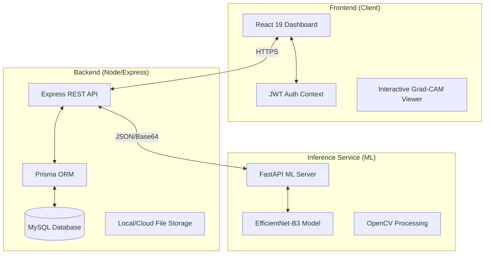

# ClariEye AI: Next-Gen Retinal Diagnostic Platform

ClariEye is a professional-grade clinical diagnostic platform that leverages **Deep Learning (EfficientNet-B3)** and **Explainable AI (Grad-CAM)** to detect, analyze, and monitor ocular diseases from retinal fundus imaging. Developed for the modern clinic, it bridges the gap between raw AI inference and actionable medical documentation.


## 📡 Live System Architecture

ClariEye operates as a distributed system, separating raw AI inference from clinical data management for maximum scalability.



---

## 🔬 Core Medical Features

### 1. AI-Driven Diagnostics (The AI Engine)
ClariEye uses a fine-tuned **EfficientNet-B3** architecture optimized for multi-class retinal classification. 
- **Disease Coverage**: Glaucoma, Cataracts, and Diabetic Retinopathy.
- **Explainability (XAI)**: Integrated **Grad-CAM** heatmaps identify morphological regions of interest (Exudates, Hemorrhages, Cupping) to provide clinicians with the "why" behind every prediction.

### 2. Clinical Workflow & RBAC
A secure, role-based access control system (RBAC) designed for multi-user medical environments:
- **Registry Management**: Full searchable patient registry with historical diagnostic tracking.
- **Clinical Annotation**: An interactive canvas allowing doctors to manually mark pathological findings directly on AI-generated heatmaps.
- **Audit Logs**: Comprehensive system telemetry tracking patient data access and diagnostic changes.

### 3. Patient Progression Monitoring
The **Longitudinal Progression Wizard** tracks changes in patient confidence scores and diagnostic outcomes across multiple visits, providing a visual trendline for disease management.

---

## 🖥️ User Interface Gallery

| Clinical Portal (Login) | Patient Registration |
| :---: | :---: |
|  |  |

| Clinical Dashboard (Overview) | Analytics & Throughput |
| :---: | :---: |
|  |  |

| Infrastructure Logs & Arrivals | Patient Registry |
| :---: | :---: |
|  |  |

| Diagnostic Analysis (XAI) | Automated Findings Report |
| :---: | :---: |
|  |  |

---

---

## 🛠️ Technical Stack

| Layer | Technologies |
| :--- | :--- |
| **Frontend** | React 19, Vite, Tailwind CSS 4, Framer Motion, Recharts |
| **Backend** | Node.js, Express, Prisma ORM, MySQL |
| **Machine Learning** | Python, TensorFlow 2.15, FastAPI, OpenCV |
| **Documentation** | JSON Web Tokens (JWT), Axios, jsPDF |

---

## 🚀 Installation & Deployment

### Backend Setup (Node.js)
```bash
cd server
npm install
# Configure your .env (DB_URL, JWT_SECRET, ML_SERVER_URL)
npx prisma db push
node index.js
```

### Inference Setup (Python)
```bash
cd ml
pip install -r requirements.txt
# Run the FastAPI server
python serve.py
```

### Frontend Setup (Vite)
```bash
cd client
npm install
# Set VITE_API_BASE_URL in .env
npm run dev
```

---

## 🛡️ Security & Privacy
ClariEye implements industry-standard security protocols:
- **Environment Isolation**: No secrets or hardcoded endpoints are stored in version control.
- **Session Security**: JWT-based authentication with secure local storage handling.
- **Data Integrity**: Enforced foreign key constraints via Prisma for clinical record consistency.

## 📜 License & Credits
Licensed under the **MIT License**. 

---
**Disclaimer**: *ClariEye is an AI research prototype. It is intended to assist medical professionals and should not be used as a standalone diagnostic tool without clinician verification.*
